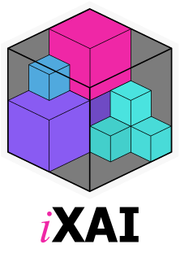

<p align="center">
  
</p>

<p align="center">
  <!-- Read the Docs -->
  <a href='https://ixai.readthedocs.io/en/latest/?badge=latest'>
      
  </a>
  <!-- PyPI Version -->
  <a href="https://pypi.org/project/ixai">
    
  </a>
  <!-- PyPI status -->
  <a href="https://pypi.org/project/ixai">
    
  <!-- License -->
  <a href="https://opensource.org/licenses/MIT">
    
  </a>
</p>

# iXAI: Incremental Explainable Artificial Intelligence
> Demystifying the black-box, piece by piece.
                                                                                         
This is the first iteration of our incremental explanation package. Currently, it includes two explanation methods: PFI and SAGE. Please look at the examples in the `examples` directory. Please help us in improving our work by contributing or pointing to issues. We will update this iteration soon with further information.

## 🛠 Installation
**ixai** is intended to work with **Python 3.8 and above**. Installation can be done via `pip`:

```sh
pip install ixai
```

## 📊 Quickstart

### Basic Classification
```python
>>> from river.metrics import Accuracy
>>> from river.ensemble import AdaptiveRandomForestClassifier
>>> from river.datasets.synth import Agrawal

>>> from ixai.explainer import IncrementalPFI

>>> stream = Agrawal(classification_function=2)
>>> feature_names = list([x_0 for x_0, _ in stream.take(1)][0].keys())

>>> model = AdaptiveRandomForestClassifier(n_models=10, max_depth=10, leaf_prediction='mc')

>>> incremental_pfi = IncrementalPFI(
...     model_function=model.predict_one,
...     loss_function=Accuracy(),
...     feature_names=feature_names,
...     smoothing_alpha=0.001,
...     n_inner_samples=5
... )

>>> training_metric = Accuracy()
>>> for (n, (x, y)) in enumerate(stream, start=1)
...     y_pred = model.predict_one(x)       # inference
...     training_metric.update(y, y_pred)   # update score
...     incremental_pfi.explain_one(x, y)   # explaining
...     model.learn_one(x, y)               # learning
...     if n % 1000 == 0:
...         print(f"{n}: Accuracy: {training_metric.get():.3f}, PFI: {incremental_pfi.importance_values}")

1000: Accuracy: 0.785, PFI: {'age': 0.22, 'elevel': 0.18, 'zipcode': -0.07, 'salary': 0.04, 'commission': 0.05, 'loan': -0.06, 'car': 0.02, 'hyears': 0.03, 'hvalue': 0.03}
2000: Accuracy: 0.841, PFI: {'age': 0.26, 'elevel': 0.21, 'zipcode': -0.01, 'salary': 0.02, 'commission': 0.03, 'loan': -0.02, 'car': 0.02, 'hyears': 0.04, 'hvalue': 0.02}
3000: Accuracy: 0.921, PFI: {'age': 0.28, 'elevel': 0.24, 'zipcode': -0.00, 'salary': 0.00, 'commission': 0.01, 'loan': -0.01, 'car': 0.01, 'hyears': 0.01, 'hvalue': 0.00}
```

## 📖 Documentation
The documentation for ``ixai`` can be found [here](https://ixai.readthedocs.io/en/latest/).
